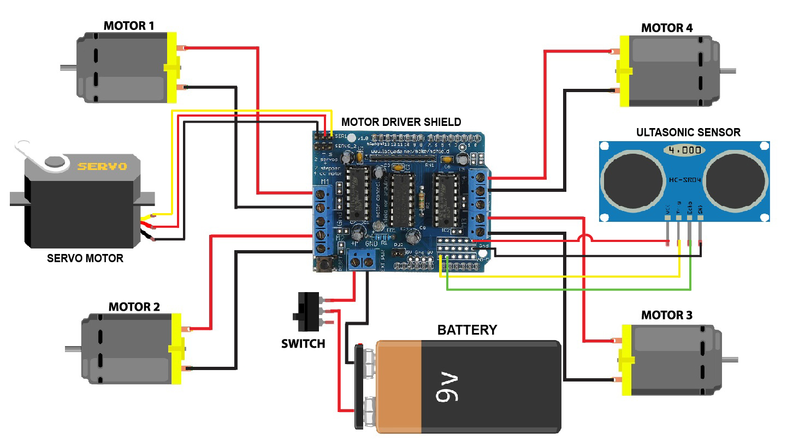

# 🚗 Arduino Obstacle Avoiding Car

An autonomous robot car built with Arduino that detects and avoids obstacles using an ultrasonic sensor, motor driver shield, and a servo-mounted distance scanner.

---

## 📷 Overview

This project uses an **ultrasonic sensor** to detect obstacles and a **servo motor** to rotate the sensor for left and right distance measurements. Based on the data, the car decides whether to move forward, backward, or turn.

---

## 🛠 Components Required

| Component                        | Quantity | 
|----------------------------------|----------|
| Arduino Uno                      | 1        | 
| Adafruit Motor Shield (AFMotor) | 1        | 
| Ultrasonic Sensor (HC-SR04)      | 1        | 
| Servo Motor (SG90 or MG90S)     | 1        | 
| DC Motors (BO Motors)           | 4        | 
| Wheels                          | 4        |
| Chassis                         | 1        |
| 12V Battery or Power Supply     | 1        |
| Jumper Wires                    | as needed|

---

## 🔌 Wiring Diagram

| Module        | Arduino Pin | 
|---------------|-------------|
| HC-SR04 Trig  | A0          | 
| HC-SR04 Echo  | A1          |                                
| Servo Signal  | Pin 10      |                                
| Motor Shield  | Uses Pins 3–12 internally |

> Make sure the Motor Shield is firmly seated on the Arduino Uno.

---
## 📷 Circuit Diagram

Below is the connection diagram for the Obstacle Avoiding Car:


---
## 🧠 Libraries Used

Install these libraries via the Arduino IDE:

1. **AFMotor**  
   [AFMotor Library](https://github.com/adafruit/Adafruit-Motor-Shield-library)

2. **NewPing**  
   [NewPing GitHub](https://github.com/livetronic/Arduino-NewPing)

3. **Servo**  
   [Servo GitHub](https://github.com/arduino-libraries/Servo.git)

---

## 📜 How It Works

- At startup, the servo centers and the sensor takes a few distance samples.
- In `loop()`, the car:  
  - Moves forward if no obstacle is detected (`> 15cm`)  
  - Stops and reverses briefly if an obstacle is within `15cm`  
  - Looks both left and right using the servo-mounted sensor  
  - Turns in the direction with more space
- Uses `Serial.print()` statements for live debugging and monitoring via Serial Monitor.

---

## 🖥 Serial Monitor Output

Set baud rate to **9600**. You'll see:
```
Servo centered to 115°
Initial distance: 42
Path is clear. Moving Forward...
Measured Distance: 41
Obstacle detected! Executing avoidance sequence...
Distance Right: 60
Distance Left: 45
Turning Right...
```

---

## 🧑‍💻 Author

**Rupesh Thakur**  
> Passionate about robotics, IoT, and automation projects.
